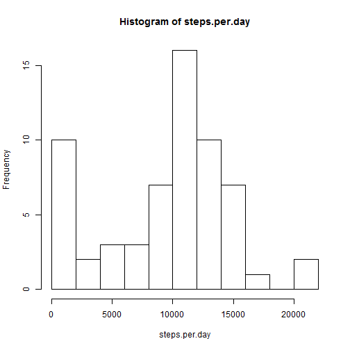
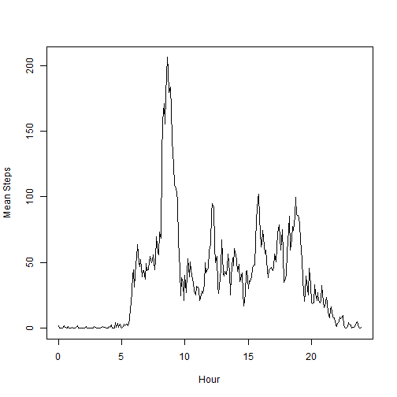
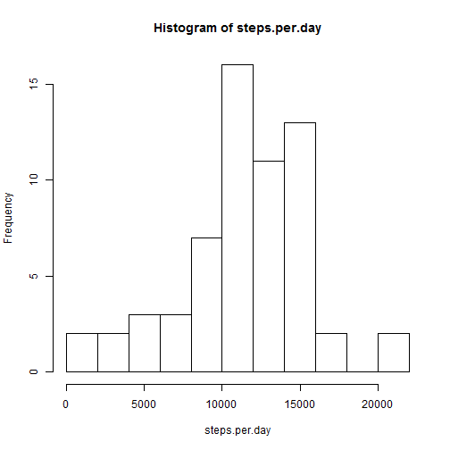
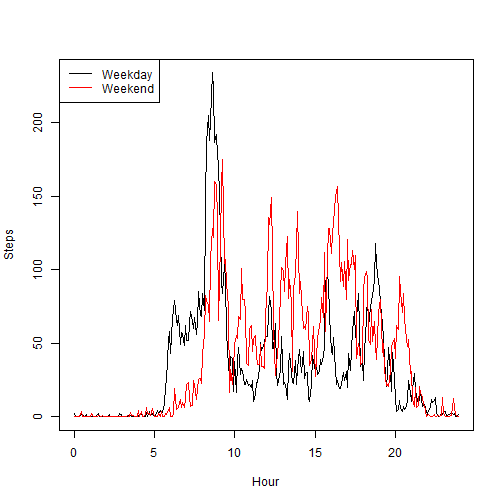

## Loading and preprocessing the data
  

```r
# activ <- read.csv("activity.csv")
activ <- read.csv(unz("repdata_data_activity.zip",
                      "activity.csv"))
```
  
## Mean total number of steps taken per day
  

```r
steps.per.day <- tapply(activ$steps, activ$date, sum, na.rm=T)
hist(steps.per.day, breaks=10)
```



```r
mean(steps.per.day)
```

```
## [1] 9354.23
```

```r
median(steps.per.day)
```

```
## [1] 10395
```

## Average daily activity pattern
Here we compute and plot


```r
mean.by.interval <- tapply(activ$steps, activ$interval, mean, na.rm=T)
Hour = (0:287)*5/60
plot(Hour,mean.by.interval, type="l", ylab="Mean Steps")
```



Invterval with highest mean number of steps

```r
i.max <- match(max(mean.by.interval), mean.by.interval)
names(mean.by.interval)[i.max]
```

```
## [1] "835"
```
  
Results in 835 when I run the code, i.e. 8:35 am. 
I would guess this is the subject's commute to work. 

## Imputing missing values

Checking the number of NA values

```r
sum(!complete.cases(activ))
```

```
## [1] 2304
```

```r
# Also verify that `date` and `interval` are all there
sum(!complete.cases(activ[,c("date","interval")]))
```

```
## [1] 0
```
  
Yep, all NAs are in the `steps` field  
  
---

Since the variation between weekend and weekday will be computed, 
missing data will be  
generated based on means and standard deviations considering 
*both* interval and  
day type.  Here's the computation:


```r
weekday.or.end <- function(datestring) {
    if(strftime(strptime(datestring, "%Y-%m-%d"), "%u") %in% c(6,7))
        "weekend"
    else
        "weekday"
}
activ$daytype <- factor(sapply(activ$date, weekday.or.end))

mean.by.int.and.daytype <- tapply(activ$steps,
                                  list(activ$interval, activ$daytype),
                                  mean, na.rm=T, simplify=T)

sd.by.int.and.daytype <- sqrt(tapply(activ$steps,
                                  list(activ$interval, activ$daytype),
                                  var, na.rm=T, simplify=T))
```

Now do the replacements


```r
mbiad <- mean.by.int.and.daytype
sbiad <- sd.by.int.and.daytype

# Function to convert real number from the random generator
# to a non-negative integer
naturalize <- function(x) (x >= 0)*round(x)

set.seed(0)
activ.impu <- activ
for(k in 1:nrow(activ)){
    if(is.na(activ[k,"steps"])) {
        mean.steps <- mbiad[ as.character(activ[k,"interval"]) ,
                            activ[k,"daytype"] ]
        sd.steps <- sbiad[ as.character(activ[k,"interval"]) ,
                           activ[k,"daytype"] ]
        
        activ.impu[k,"steps"] <- naturalize(rnorm(1, mean.steps, sd.steps))
    }
}
```
  
Now we redo the histogram plot, and mean and median computations


```r
steps.per.day <- tapply(activ.impu$steps, activ$date, sum, na.rm=T)
hist(steps.per.day, breaks=10)
```



```r
mean(steps.per.day)
```

```
## [1] 11334.98
```

```r
median(steps.per.day)
```

```
## [1] 11458
```

As would be expected, the mean and median increase, and the histrogram 
shifts to the right.

## Differences in activity patterns  
## between weekdays and weekends
Since it seems more interesting to see the two time series overlayed, 
the plots are done like that.


```r
Hour = (0:287)*5/60
plot(Hour, mean.by.int.and.daytype[,"weekday"]
     , type="l", col="black", ylab="Steps")
lines(Hour, mean.by.int.and.daytype[,"weekend"], col="red")
legend("topleft", legend=c("Weekday", "Weekend")
       , col=c("black","red"), lty=1)
```




Weekdays have activity concentrated in the morning while 
in weekends it is more spread out.  
There is a concentration 
in the morning, but it is not prominent as it is on weekdays.
